# Pythia Analytics

Privacy-first predictive analytics with differential privacy and real-time forecasting.

## Quick Deploy

[](
https://app.netlify.com/start/deploy?repository=https://github.com/atnightfa11/Pythia-analytics)

## Setup (5 minutes)

1. **Deploy** - Click the button above or fork and connect to Netlify
2. **Database** - Create a [Supabase](https://supabase.com) project and run the migrations from `supabase/migrations/`
3. **Environment** - Add your Supabase credentials to Netlify environment variables
4. **Test** - Visit `/.netlify/functions/test-connection` to verify setup

## Environment Variables

```env
VITE_SUPABASE_URL=https://your-project.supabase.co
VITE_SUPABASE_ANON_KEY=your_anon_key_here
SUPABASE_SERVICE_ROLE_KEY=your_service_role_key_here
NETLIFY_URL=https://your-site.netlify.app
PYTHON_SERVICE_URL=https://forecasting-service.fly.dev
```

📖 **[Full Setup Guide](/docs)** - Complete installation and configuration

---

## Features

- **🔒 Differential Privacy**: Client-side noise injection (ε=1.0) with mathematical guarantees
- **📈 Predictive Modeling**: Prophet forecasting with <16% MAPE accuracy
- **🚨 Smart Alerts**: Automated anomaly detection with Slack notifications
- **🍪 Cookieless Tracking**: No cookies, no persistent identifiers
- **⚡ Real-time Analytics**: Live visitor tracking and event monitoring
- **🗺️ Geographic Insights**: Timezone-based country detection (privacy-preserving)

## 🔒 Privacy Policy

### **Data Collection & Privacy Principles**

Pythia Analytics is built with privacy as the foundation. We implement multiple layers of privacy protection:

#### **🎯 Core Privacy Commitments**

- **No Personal Identifiers**: We never collect names, emails, IP addresses, or any personally identifiable information
- **Client-Side Processing**: All data processing happens in your users' browsers, never on our servers
- **No Cross-Site Tracking**: Analytics data is scoped to your single domain only
- **User-Controlled Data**: Users can clear all data anytime through browser settings

#### **🕒 Data Retention & Automatic Cleanup**

**Session Data (24 hours)**:

- **Session Data**: Session IDs are automatically regenerated every 24 hours
- **No Persistent Tracking**: No persistent tracking across sessions
- **Natural Expiration**: Session data expires naturally and cannot be recovered

**Browser Storage Cleanup (7 days)**:

- **Safari ITP Mirror**: Mirrors Safari's Intelligent Tracking Prevention (ITP) limits
- **Automatic Cleanup**: All localStorage and sessionStorage data automatically cleaned up after 7 days
- **Proactive Removal**: Old session data is proactively removed to prevent accumulation
- **Data Integrity**: Data corruption detection and automatic cleanup of malformed data

**Event Data (Configurable)**:

- **Your Database**: Raw events are stored in your Supabase database
- **User Control**: Retention period is controlled by your database policies
- **Full Control**: No automatic deletion - you control data lifecycle

#### **🔐 Differential Privacy Implementation**

**Noise Injection**:

- **Laplace Noise**: All numeric data receives Laplace noise before transmission
- **Configurable Privacy**: Privacy budget (ε) is configurable per user (default: ε=1.0)
- **Privacy-Strength Balance**: Higher privacy settings add more noise for stronger protection
- **Mathematical Guarantees**: Mathematical guarantees prevent re-identification

**Geographic Data**:

- **Timezone-Based**: Country detection uses browser timezone only (no GPS or IP geolocation)
- **Approximate Mapping**: Approximate mapping: timezone → country code (e.g., "America/New_York" → "US")
- **No Precise Location**: No precise location data or regional identification
- **DP Compatible**: Fully compatible with differential privacy noise

#### **🌐 Data Flow Security**

```mermaid
graph TD
    A[User Browser] --> B[Client-Side Processing]
    B --> C[Noise Injection + ε Control]
    C --> D[Encrypted Transmission]
    D --> E[Your Database Only]
    F[No External Services] --> E
```



**Security Features**:

- **HTTPS Encryption**: All data transmitted over HTTPS
- **No Third Parties**: No third-party analytics services
- **No Data Sharing**: No data sharing or selling
- **Clean Logs**: Server-side logs contain no user identifiers

#### **📊 What We Collect**

**Technical Data Only**:

- **Event Types**: Event types (pageview, click, custom events)
- **Event Counts**: Event counts with differential privacy noise
- **Device Type**: Device type (from User-Agent string)
- **Approximate Country**: Approximate country (from timezone)
- **Session Duration**: Session duration and page interactions
- **UTM Parameters**: UTM parameters (marketing attribution)

**What We DON'T Collect**:

- ❌ **No IP Addresses**: IP addresses or geolocation data
- ❌ **No Personal Info**: Names, emails, or personal information
- ❌ **No Fingerprints**: Browser fingerprints or device IDs
- ❌ **No Cross-Site Tracking**: Cross-site tracking data
- ❌ **No Server-Side ID**: Any server-side user identification

#### **🗑️ Data Deletion & User Rights**

**Immediate Data Deletion**:

```javascript
// Users can clear all data immediately:
localStorage.clear()
sessionStorage.clear()

// Or selectively:
localStorage.removeItem('pythia_session_id')
localStorage.removeItem('pythia_session_timestamp')
```

**Database Data**:

- **Supabase Dashboard**: Delete data through your Supabase dashboard
- **Domain-Scoped**: All events are tied to your domain only
- **No Portability**: No data portability requirements (aggregate analytics only)

#### **⚖️ Legal Compliance**

- **GDPR Compliant**: No personal data collection
- **CCPA Compliant**: No sale or sharing of personal information
- **No Cookies**: Cookie-free implementation
- **No Tracking**: No cross-site or behavioral tracking

#### **🔧 Technical Implementation**

**Automatic Cleanup Code**:

```javascript
// Session expiration (24 hours)
const SESSION_DURATION = 24 * 60 * 60 * 1000 // 24 hours

// Data cleanup (7 days) - mirrors Safari ITP
const MAX_SESSION_AGE = 7 * 24 * 60 * 60 * 1000 // 7 days
if (sessionAge > MAX_SESSION_AGE) {
  localStorage.removeItem('pythia_session_id')
  localStorage.removeItem('pythia_session_timestamp')
}
```

**Differential Privacy Code**:

```javascript
// Laplace noise injection
const noise = Math.random() * 2 - 1 // Random between -1 and 1
const noisyCount = event.count + noise * epsilon
```

**Automatic Cleanup Code**:

```javascript
// Proactive data cleanup - mirrors Safari ITP
function cleanupOldData() {
  const sessionAge = Date.now() - parseInt(sessionTimestamp)
  const MAX_SESSION_AGE = 7 * 24 * 60 * 60 * 1000 // 7 days

  if (sessionAge > MAX_SESSION_AGE) {
    localStorage.removeItem('pythia_session_id')
    localStorage.removeItem('pythia_session_timestamp')
    sessionStorage.removeItem('pythia_utm_params')
  }
}
```

**Country Detection Code**:

```javascript
// Privacy-preserving geographic detection
function getCountryFromTimezone() {
  const timezone = Intl.DateTimeFormat().resolvedOptions().timeZone

  // Approximate mapping: timezone → country code
  const timezoneToCountry = {
    'America/New_York': 'US', 'Europe/London': 'GB',
    'Europe/Berlin': 'DE', 'Asia/Tokyo': 'JP'
    // ... etc - no IP addresses involved
  }

  return timezoneToCountry[timezone] || 'Unknown'
}
```

---

## 📖 Documentation

📖 **[Complete Setup Guide](/docs)** - Detailed installation, configuration, and troubleshooting
🧠 **[How Differential Privacy Works](/blog/differential-privacy)** - Technical deep dive
🔒 **[Privacy Policy](PRIVACY_POLICY.md)** - Comprehensive privacy documentation

## Development & Testing

### End-to-End Testing Workflow

1. **Setup Environment**:

   ```bash
   # Copy environment template
   cp .env.example .env
   # Fill in your Supabase credentials in .env
   ```

2. **Seed Test Data**:

   ```bash
   npm run seed
   ```

   This injects 30 days of realistic aggregate data with randomized mobile/desktop traffic patterns.

3. **Start Development Server**:

   ```bash
   npm run dev
   # Or with Netlify dev (recommended)
   npx netlify dev
   ```

4. **Test Forecast API**:

   ```bash
   npm run forecast
   ```

   This calls `/.netlify/functions/forecast?force=true` and prints MAPE + generatedAt.

### Browser Console Testing

```javascript
// Check system status
pythiaStatus()           // Buffer size, privacy settings, session info

// Send test events
pythia('test_event', 1)  // Basic event
pythia('signup', 1, { source: 'test' })  // Conversion event

// Manual operations
flushPythia()           // Force buffer flush

// Privacy controls
window.pythiaStore.getState()  // Check current ε value
```

### Expected Results

- **Data Seeding**: `✅ Successfully seeded X events!`
- **Forecast API**: Should return MAPE < 30% with 30 days of future predictions
- **Dashboard**: Shows live MAPE, forecast accuracy, and real-time alerts
- **Alerts**: Trigger alerts with synthetic traffic spikes within 60 seconds
- **Privacy**: Buffer flushes with randomized intervals (20-80s) and includes ε metadata

### Environment Variables

### Local Development (.env file)

```env
# Required
VITE_SUPABASE_URL=https://your-project.supabase.co
VITE_SUPABASE_ANON_KEY=your_anon_key_here

# Optional - Testing
SITE_URL=http://localhost:5173
FORECAST_LOOKBACK_DAYS=60
FORECAST_HORIZON_DAYS=30
NETLIFY_ALERT_POLL_MS=30000
SLACK_WEBHOOK_URL=your_slack_webhook_url
```

### Live Deployment (Netlify Environment Variables)

**CRITICAL**: These must be set in your Netlify dashboard for live deployment to work:

```bash
# Required for Functions
SUPABASE_URL=https://your-project.supabase.co
SUPABASE_SERVICE_ROLE_KEY=your_service_role_key  # Required for forecast function
SUPABASE_ANON_KEY=your_anon_key_here

# Netlify Environment Detection
NETLIFY=true
SITE_URL=https://your-site-name.netlify.app

# Required for Client-side
VITE_SUPABASE_URL=https://your-project.supabase.co
VITE_SUPABASE_ANON_KEY=your_anon_key_here

# Optional - Alert Configuration
ALERT_THRESHOLD=0.2
NETLIFY_ALERT_POLL_MS=30000
SLACK_WEBHOOK_URL=your_slack_webhook_url

# Optional - Forecast Configuration
PYTHON_SERVICE_URL=https://forecasting-service.fly.dev
FORECAST_LOOKBACK_DAYS=60
FORECAST_HORIZON_DAYS=30
```

### Setting Environment Variables in Netlify

1. **Go to Netlify Dashboard** → Select your site
2. **Navigate to**: Site Configuration → Environment Variables
3. **Add each variable** with its corresponding value
4. **Trigger rebuild**: Push to Git or manually trigger deploy

### Debugging Environment Variables

Check which environment variables are set in your live deployment:

```bash
curl "https://your-site-name.netlify.app/.netlify/functions/debug-env"
```

### Why Your Forecast Shows 11.9% MAPE on Live

**Root Cause**: Missing `SUPABASE_SERVICE_ROLE_KEY` in live deployment

**What's Happening**:

- Local development may work with anon key in some cases
- Live deployment requires service role key for forecast function
- When service role key is missing, forecast function fails and returns default 11.9% MAPE
- This is why it works locally but not when deployed

**Solution**:

1. Get your Supabase service role key from Supabase Dashboard → Settings → API
2. Add `SUPABASE_SERVICE_ROLE_KEY=your_key_here` in Netlify environment variables
3. Trigger a new deployment

## Architecture

- **Frontend**: React + TypeScript + Vite + Tailwind CSS
- **Backend**: Netlify Functions + Supabase PostgreSQL
- **Forecasting**: Python FastAPI service on Fly.io with Prophet
- **Privacy**: Client-side differential privacy with Laplace noise

---

Privacy-first analytics with predictive insights*
